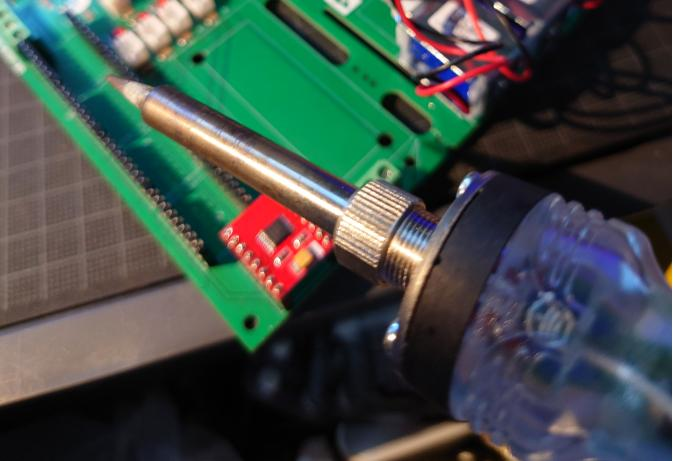
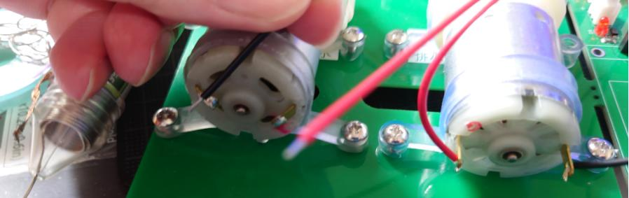
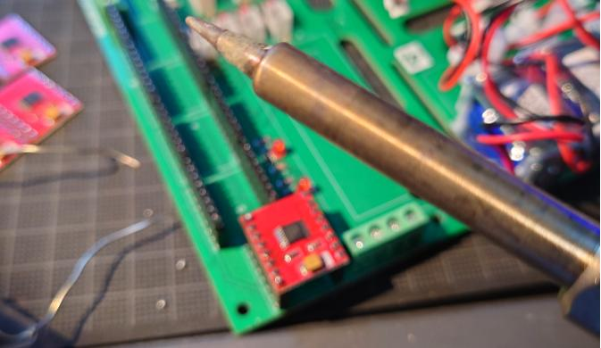
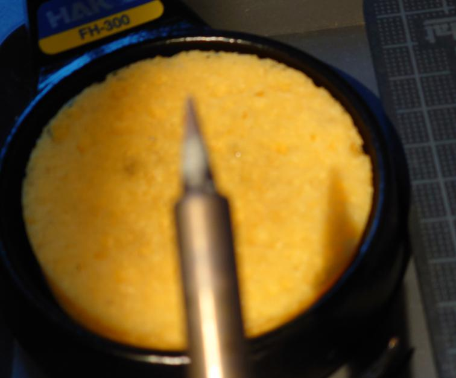

# アブストラクション

電子基板を作成・修理する際はんだ付けは現在のところ重要な項目である。

今回宇宙農場計画の検証の為栽培制御用ロボット基板一部組み立てが必要になり、その中にはんだ付けも含まれる。

しかしそのはんだ付けには変化がありそれにより認識と知識を更新しなければいけなくなった。
本稿ではその認識と知識について記述し、同じような境遇にある者への継承として残しておく。

はんだ付けの歴史についてはあまり触れないが、鉛入りハンダを使用したはんだ付けと鉛フリーハンダを使用したはんだ付けの違いについて記述するものとする。

はんだ付け猛者の方々には何を今更こんな初歩的なものをと言われそうだが、初級者及び復帰者には充分なハードルだと考えられるため、批判はせず御笑覧いただきたい。

本稿では宇宙農場との関連として栽培用制御ロボット(https://qiita.com/nanbuwks/items/e667d432a697669dcc93)の組み立て時に必要なはんだ付けについても解説する。

# はじめに

2024年末、コミックマーケット105帰りに秋葉原ロボット部と秘密結社オープンフォースのサークル関係者による合同打ち上げが行われていた。

その会場となったロボスタディオン( @robostadion )にて皆で観ていたテレビ番組「フジテレビ系「街頭でクイズください！出題するあなたは何者？」」という番組内で北神氏( @nonNoise )が秋葉原の街頭でインタビューを受けた際、番組に対してクイズを出題してくださいと言われハンダの溶ける温度を出題したら番組スタッフから難しすぎて駄目だと言われていた。

確かに市井の方々は今どきはんだ付けなどしないのかもしれない。しかし昭和の時代はどの家にもはんだごては転がっていたし簡単な配線の修理で使っていた。

また中学の技術科授業では実際にはんだ付けして簡単なもの(筆者の場合はお風呂ブザーやはんだごて)を作っていたが、それ以降はんだごてに触らないで過ごした諸兄も多いのではないだろうか。

昨今のIoTブームにより現代のマイクロコンピュータに触れる機会が発生し、それと共にマイクロコンピュータチップを含む電子基板を扱う際久しぶりに昔取った杵柄と古いはんだごてを奥から引っ張り出したケースもあるのではないだろうか。

フロントエンドエンジニアであり高レイヤ言語使いである筆者もそのにわか勢であり、宇宙農場計画に際して栽培用制御ロボットの組み立ての中のはんだ付けという作業をする必要に迫られた。

この本稿ではそういった「昔はんだ付けしたけれど暫くやっていなくて最近久しぶりにやってみた」方々に向けて記述するものとする。

# ハンダの溶ける温度は!?
前述の番組で出題されかけた「ハンダの溶ける温度は何度でしょうか？」という問題の答えは番組中では結局わからなかった。過去に授業ではんだ付けを教わった筆者でもそれを覚えてはいなかった。

中学の技術科授業にてはんだ付けを教わったにも関わらずハンダの溶ける温度を知らない。これはただ単に筆者が忘れていたか勉強不足なだけかもしれないが、それ以上の理由があると考えられる。

それは、 **「当時は温度などあまり気にしなくてもはんだ付けできる環境であった」** からである。

# 当時の環境
筆者は団塊ジュニア世代である。平成になったばかりのまだ昭和を色濃く残した頃に中学生を過ごした。
当時はハンダと言えば鉛が入っており、中学の授業の際に溶かした際の煙は有害だから良く換気して吸わないようにと注意されていた。
[^1][^2]

## はんだ付けを実際にやった手順
- はんだごてを接合面に当てる
- ハンダを当てる
- 溶けて溶着したところでタイミングよくハンダを離す
- すぐはんだごてを離す

こんな形で簡単にでき、温度調節機能付きはんだごてもそれほど必要が無かった。
また、こて先の管理も「酸化したら紙やすりでこすって奇麗にしたらよい」というものであった。

## 注意するところは、精々…
- はんだごての当てすぎで電子部品を熱で壊さないようにする
- ハンダが酸化しないよう注意する

くらいである。これは現在も同様であるが現在使われる鉛フリーハンダではハンダの酸化に関してはより機敏に注意する必要がある。

# 現在の環境
前項に対して現在は鉛フリーハンダを使用したはんだ付けが主流となっている。

## ハンダの温度に関しては

- 鉛フリーハンダは種別によるが一般に **220～230℃** で溶ける [^3] 
- はんだ付け接合面は **+50℃** が必要で
- はんだごて先は更に **+100℃** の温度が必要
- 合計 **370～380℃** となる。

この温度はハンダが酸化しやすい温度でもある。
このためハンダとはんだごて先は恐ろしい速さで酸化してゆく。

このためはんだごて先は接合面に **+60℃** 程度に温度調節する必要があると引用資料 [^3] では解説している。

## はんだごてにおける温度調節の必要性
鉛フリーハンダを使用したはんだづけには機敏な温度調節が必要なのは前項で記した。そのためはんだごて自体にも温度調節の機能が必須となっている

ではどのようなはんだごてを使えば良いのだろうか。

- 筆者が現在使用している廉価なはんだごて
https://www.hakko.com/japan/products/hakko_fx600.html

本体グリップダイヤルで温度調節ができる機能がある。こて先もamazon等で入手しやすく、温度設定も作業中に変更するのは大変だが廉価で持ち運びがしやすい。
しかしヒーター部の温度調節はできてもこて先やはんだづけ接合面の温度をみているわけではない。

- 温調機能の優れた(高価な)はんだごて
https://www.hakko.com/japan/products/hakko_fx951.html

これは高価で持ち運びもしにくくなってくる。温度調節が細かくしやすく、こて先に近い部分で温度をみているので温度調節の正確性を謳っているが…いかんせん高価である。

- 秋葉原ロボット部と関連の深い秘密結社オープンフォースが開発し技術カンファレンスIoTLTの名前を冠した通販サイトで比較的廉価に販売しているはんだごて(過去にはキットもあった)
 https://iotlt.myshopify.com/products/iotlt-t12-%E3%82%B9%E3%83%86%E3%83%BC%E3%82%B7%E3%83%A7%E3%83%B3%E5%9E%8B%E3%81%AF%E3%82%93%E3%81%A0%E3%81%94%E3%81%A6

筆者が秘密結社オープンフォースに泣きついた結果？誕生したmade in shinsenのはんだごてである。筆者は貧乏の為まだ買えてないが何度か使わせてもらっている。こて先は独自規格のため入手性に難があるが細かい温度調節ができ比較的廉価である。

ちなみに過去キットも存在したが熱センサー部の工作難易度が高いため（オープンフォース総統は「簡単ですよ～」というが）初心者向けではない。

## こて先について
前項でこて先交換について触れていたが、鉛フリーハンダではんだ付けをすると恐ろしいスピードでこて先が酸化していくためこて先を交換する頻度は上がるように感じる。

そもそも鉛がハンダに混ぜられている理由に酸化防止というものもある。鉛の有害性のため鉛フリーハンダが主流になったのだが、その代わりにこて先の寿命が比較的短くなるのでこて先交換も仕方のないことなのだろう。

またはんだごてによく付属する先が細い円錐形になるこて先以外にも、カッターの刃のようなこて先もありT18-Kタイプと呼ばれている。このタイプは熱容量が高く、はんだ結合部分に刃のような部分をぴったり当てることでより早く熱を伝えやすいものである。
慣れないとうまくハンダ結合部分にぴったりくっつけられないこともあるので交換するかは人による。

どちらを使うにしても交換用のこて先を用意しておくに越したことはない(少々割高感を感じるが)

こて先の寿命を延ばすためにも水を含ませた専用のスポンジクリーナーやワイヤークリーナーで奇麗にし、こて先が空気に触れにくいよう常に少量のハンダを含ませる必要がある。
また、安全のためにもこて先を差し込むようにきちんと固定できるこて台を使用した方が良いだろう。

この辺りも鉛入りハンダを使った際によくやっていた、灰皿や缶の蓋の内側にこて先をこすりつけて奇麗にして更に縁にこてを置いてこて台として使うようなやり方は推奨できない。

# 栽培用制御ロボットの組み立てに必要なはんだ付け
ここからは宇宙農場本向けの寄稿として栽培用制御ロボット(https://qiita.com/nanbuwks/items/e667d432a697669dcc93)の組み立て時に必要とされるはんだ付けに関して解説していく。

現在のバージョンではほとんどの部品は実装済みであるため、モータドライバとピンヘッダ間及びモータ用リード線配線部にはんだ付けが必要である。

表面実装のはんだ付けは無いため比較的楽な方であるが、それでも鉛入りはんだ付けの経験しかない場合鉛フリーはんだ付けは苦戦するであろう。

ここから先は筆者が乏しい経験をもとにはんだ付けした記録を記す。

# はんだ付け、実践
ひとまず自身でできるだけ情報を集め(https://www.hakko.com/japan/support/maintenance/detail.php?seq=47)数年前購入して一度使用したはんだごて(https://www.hakko.com/japan/products/hakko_fx600.html)を使用し作業した。
しかし以前の記憶と比べてハンダが溶けにくく粘るかと思えばこて先にもなじまず金属部分につきにくい。

こちらがはんだ付けを試行した写真。ハンダがまともに乗っていない。

オープンフォース総統に相談したら「こて先が以前使用した時に酸化しているので替えましょう～」と言われたのでお勧めされたT18-Kこて先を注文する。

# 失敗例
T18-Kこて先が届いたので早速使ってみた。

こて先には酸化などからの保護のためハンダを少量流してある。

確かにハンダを多く含みやすい。しかしハンダの流れ方が流れないか多くつきすぎるかの両極端になってしまう。
こちらはモータのリード線をはんだ付けしてみた写真。はんだ接合面にはんだが乗らず滴り落ちてしまう。

こちらがモータドライバ部をはんだ付けしてみた写真。ハンダがうまく乗っていない。

# うまくいくとこうなります
温度調整がうまくいくと、昔感じたような水の表面張力に近いハンダの流れ方や付き方をすると感じる。これは生涯初めてはんだ付けをした方には分からない感覚ではあると思う。
しかし温度調整はこて先温度計測がないため、ハンダが溶けた時にはんだ付け接合面にも熱を伝えて手早くハンダを流しすぐにこて先保護のため水スポンジにつける事でこて先の温度調節をしなくてはいけない。

はんだごての温度ツマミは340℃と380℃の中間に合わせて使用した。

ロボスタディオンで現地の識者に教わりながら一部IoTLTはんだごても使用しつつ自身のはんだごてで作業した結果の写真

焦げているのは一度失敗した部分にフラックスを塗って再作業をしたため。
こて先を離すタイミングやはんだ付け直後の状態を見てやり直すか判断できるのは直接識者に教わる際の利点だろう。
この後通電テストを行い動作確認は完了した。

完成形は様々なサイトの画像[^4]で見ることもできようが、感覚に関しては体験しないと分からない部分である。
可能であれば安い初心者向けキット等で一度やってみるか、ロボスタディオン等のメイカースペースで知識のある人に教えを請うのも良いだろう。

# まとめ
はんだ付けはある意味職人芸に近いものであると思う。それゆえHowToサイトで記事を一通り読んだだけでは充分に出来るものではない部分もある。
動画サイトやSNS、DVD教材などもあるが職人芸の技術継承を一番行いやすいのはやはり対面指導だろう。

このデジタル時代でも手作業が必要なリアル電子基板ではアナログな職人芸が必要であり、工場等ではリフロー等の技術が確立されてはいるがイレギュラーな事態にはんだ付け作業で対応できる人材が途絶えてしまうともう取り返しがつかない。

政府や産業界が推奨するように若い人たちに丸投げするのも結構だが、些細であっても過去の経験を埋もれさせるにはまだ早いうえもったいないと感じるのは筆者だけであろうか。

# 引用資料一覧

[^1] 厚生労働省 災害防止対策ガイドブック 5.鉛または鉛化合物を使用する作業 https://kanairodo.mhlw.go.jp/pdf/worker_guidebook.pdf

[^2] 中央労働災害防止協会 安全衛生情報センター 鉛中毒予防規則 別表第四 https://www.jaish.gr.jp/horei/hor1-1/hor1-1-7-1-5.html

[^3] 白光 鉛フリーはんだを使用するとなぜ酸化しやすい？  https://www.hakko.com/japan/support/maintenance/detail.php?seq=47 

[^4] 白光 鉛フリーはんだとは？ https://www.hakko.com/japan/namari/pages/
